# 📱 Unit Calculator

A modern Android unit calculator built with **Kotlin** and **Jetpack Compose**.

Unit Calculator provides a simple calculator along with multiple unit converters in a clean and modern Material 3 interface.

---

## ✨ Features

- 🧮 Basic Calculator
- 📏 Length Converter
- ⬛ Area Converter
- 🧊 Volume Converter
- ⚖️ Weight Converter
- 🚀 Speed Converter
- 🌡️ Temperature Converter
- ⚡ Power Converter
- 🔋 Energy Converter
- 📶 Frequency Converter
- 💾 Digital Storage Converter
- ⏱️ Time Converter
- 🌙 Light & Dark Theme
- 🎨 Material 3 UI
- 📱 Jetpack Compose interface
- 📢 AdMob test ads

---

## 📸 Screenshots

### Calculator

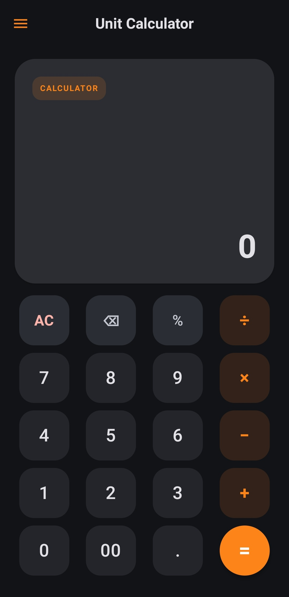

### Length

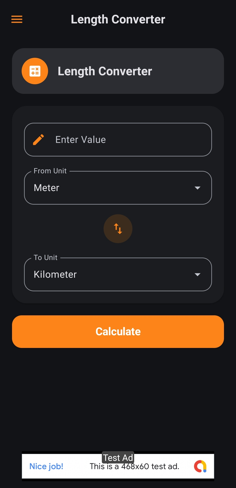

### Area

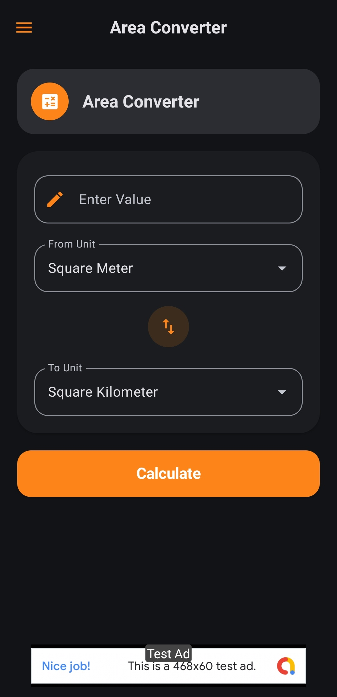

### Volume

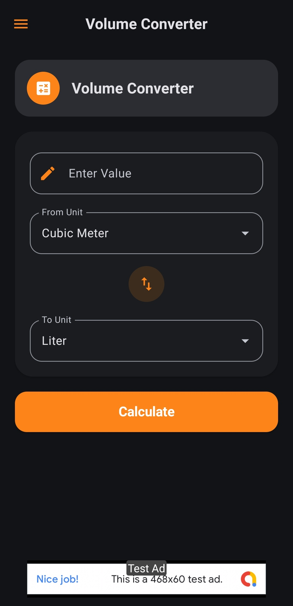

### Weight

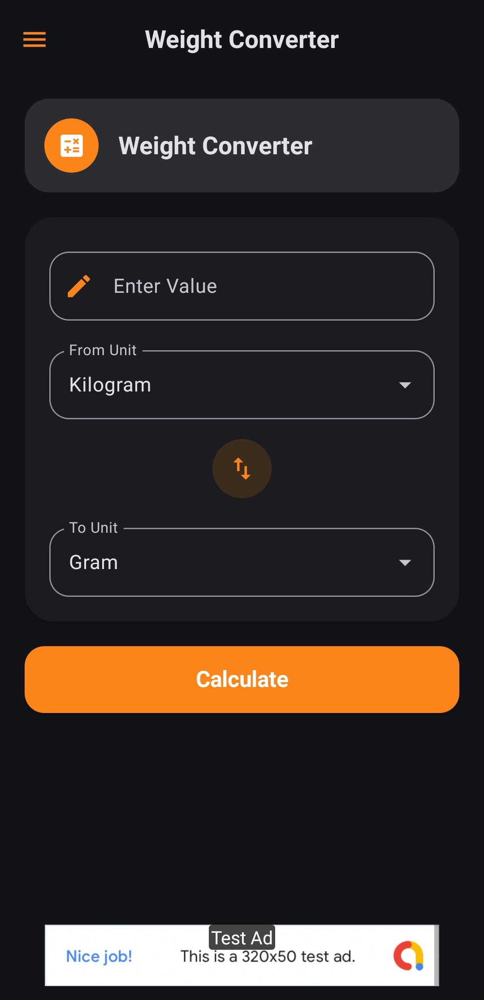

### Speed

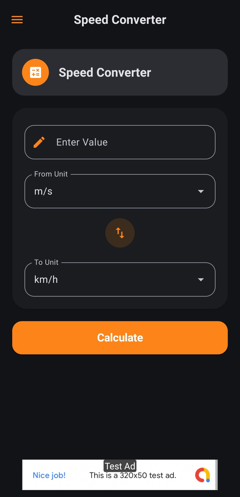

### Temperature

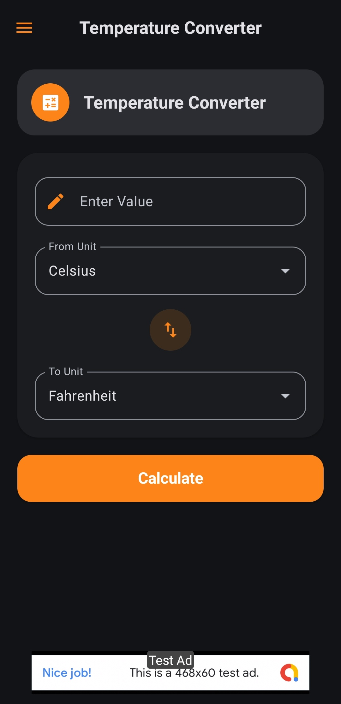

### Power

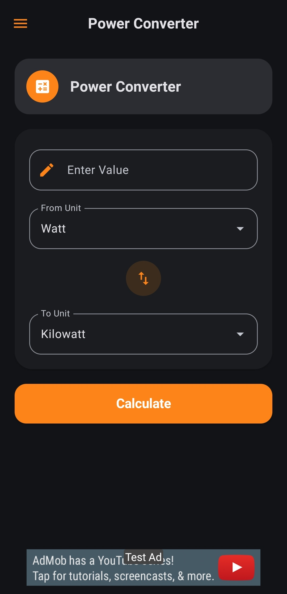

### Energy


### Frequency

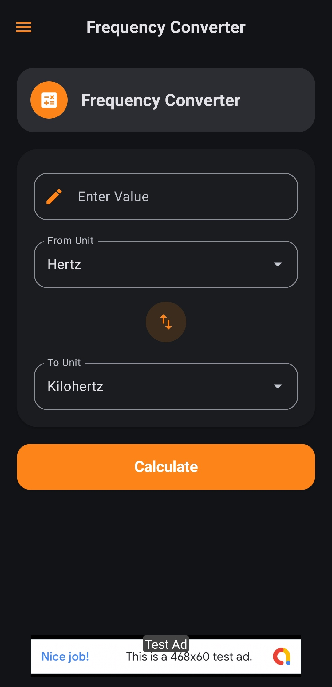

### Digital Storage

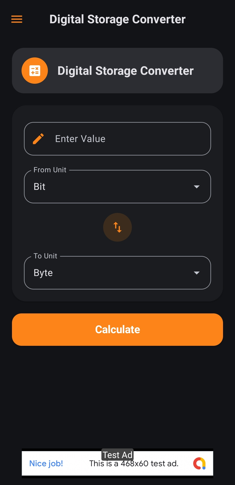

### Time

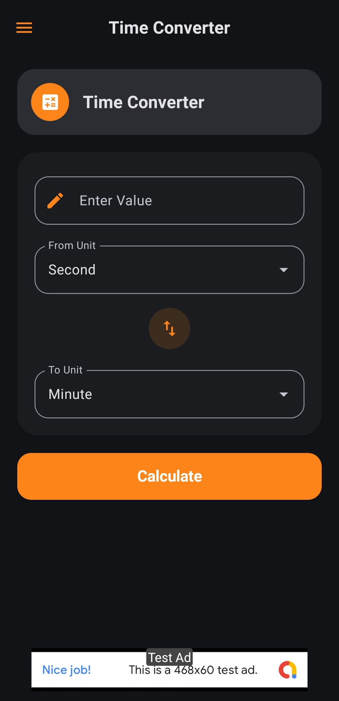

### About

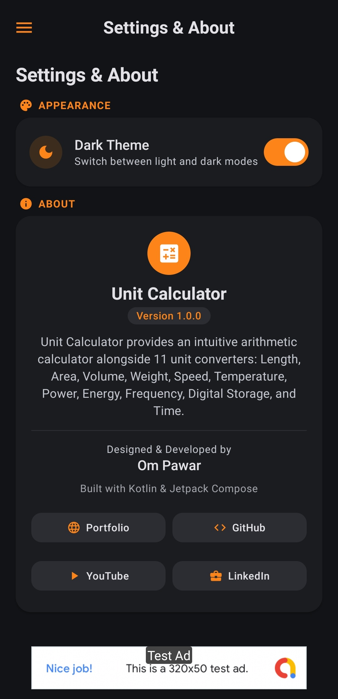

---

## 🎬 Demo

Watch the Unit Calculator app showcase:

[▶️ Watch the Demo on YouTube](https://youtube.com/shorts/I_4EWVBE6c4)

---

## 🛠️ Tech Stack

- **Kotlin**
- **Jetpack Compose**
- **Material 3**
- **Navigation Compose**
- **Preferences DataStore**
- **Google AdMob**
- **Gradle Kotlin DSL**

---

## 🏗️ Project Structure

```text
Unit-Calculator/
│
├── app/                 # Android application source
├── gradle/              # Gradle wrapper and configuration
├── screenshots/         # Application screenshots
├── releases/            # APK releases
│   └── Unit-Calculator-v1.0.0.apk
│
├── README.md
├── LICENSE
├── .gitignore
├── build.gradle.kts
├── settings.gradle.kts
├── gradle.properties
├── gradlew
└── gradlew.bat
```

---

## 📥 Download APK

The latest APK is included in the repository:

[⬇️ Download Unit Calculator APK](releases/Unit-Calculator-v1.0.0.apk)

You can also find future versions under the project's **Releases** section.

---

## 🚀 Build From Source

### Requirements

- Android Studio
- JDK 11
- Android SDK

### Clone the Repository

```bash
git clone https://github.com/0mPawar/Unit-Calculator.git
cd Unit-Calculator
```

### Build the APK

#### Windows

```bash
gradlew.bat assembleDebug
```

#### macOS / Linux

```bash
./gradlew assembleDebug
```

The generated APK will be available at:

```text
app/build/outputs/apk/debug/
```

---

## 📢 AdMob

This project currently uses **Google AdMob test ads** for development and demonstration purposes.

Production advertising IDs are not included in this repository.

---

## 👨‍💻 Developer

**Om Pawar**

Built with **Kotlin + Jetpack Compose**.

---

## 🔗 Connect

- 🌐 Portfolio: [0mPawar Portfolio](https://0mpawar.github.io/portfolio/)
- 💻 GitHub: [0mPawar](https://github.com/0mPawar)
- 🎬 YouTube: [Unidentified_Coder](https://www.youtube.com/@Unidentified_Coder)
- 💼 LinkedIn: [Om Pawar](https://www.linkedin.com/in/ompawar17)

---

## 📄 License

This project is licensed under the **MIT License**.

See the [LICENSE](LICENSE) file for details.
